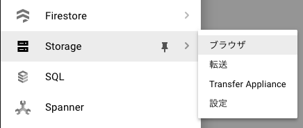
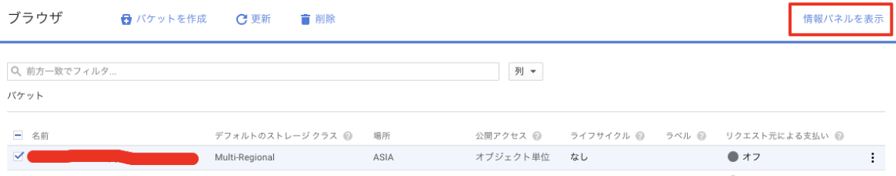
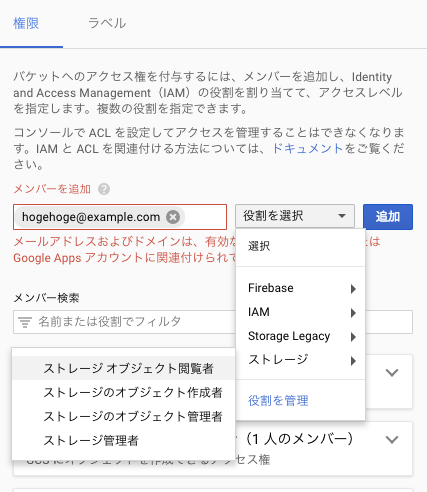

# 任意のKubernetesクラスタからのGCRへのアクセス

## 目的

任意のKubernetesクラスタからGCR上のDockerイメージをpullできるようにする。

## 設定手順

### GCP上の画面アクセス



**ストレージ -> ブラウザ** を選択。



GCRのリポジトリに対応する**バケット**を見つけて**チェックボックス**を有効化する。
情報パネルリンクをクリックして表示する。



**アカウントのメールアドレス**を設定、**役割を選択ドロップダウンメニュー**から
ストレージを選択し、**ストレージオブジェクト閲覧者**を選択する。

### Kubernetesクラスタへの設定

```bash
$ kubectl create secret docker-registry シークレット名 \
  --docker-server=https://asia.gcr.io \
  --docker-username=_json_key \
  --docker-email=hogehoge@example.com \
  --docker-password="$(cat キーファイル.json)"
```

Dockerレジストリのシークレットを`kubectl`コマンドで作成する。

```bash
apiVersion: v1
kind: Pod
metadata:
  name: test
spec:
  containers:
    - name: test
      image: asia.gcr.io/プロジェクト名/リポジトリ名:タグ
  imagePullSecrets:
    - name: シークレット名 # <= ここ
```

k8sのマニフェストファイル内、Podのspecを記述しているところで、
`imagePullSecrets`を指定する。


## 参考文献

- https://cloud.google.com/container-registry/docs/access-control
- http://docs.heptio.com/content/private-registries/pr-gcr.html
