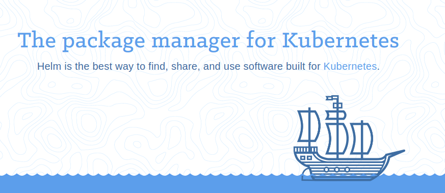

# 概要

## helm

- helmって何
    - kubernetesのパッケージマネージャ
    - Debian系ディストリビューションのapt, RHEL系のyumのk8s環境版みたいなもの

## 基本情報

- [公式ページ](https://helm.sh/)
- [リポジトリ](https://github.com/helm/helm)




# 機能リスト

- リポジトリからのチャート取得これが
- チャート間の依存関係の解決
- 独自チャート作成記法の提供


# 用語

- チャート(Chart)
    - パッケージとおもって貰えればOK

# 準備

## インストール

```bash
$ wget https://storage.googleapis.com/kubernetes-helm/helm-v2.10.0-linux-amd64.tar.gz
$ tar xvzf helm-v2.10.0-linux-amd64.tar.gz
$ mv linux-amd64/helm /usr/local/bin/
$ chown root:root /usr/local/bin/helm
$ sudo chmod +x /usr/local/bin/helm
```

## イニシャライズ

helmが動作するのに必要な各種ディレクトリなどの作成を行うとともに、
kubernetesのカレントコンテキストで指定されているクラスタの`kube-system`ネームスペースに`tiller`がインストールされます。(`tiller`については後述)

```bash
$ helm init
Creating /home/fujiwara/.helm
Creating /home/fujiwara/.helm/repository
Creating /home/fujiwara/.helm/repository/cache
Creating /home/fujiwara/.helm/repository/local
Creating /home/fujiwara/.helm/plugins
Creating /home/fujiwara/.helm/starters
Creating /home/fujiwara/.helm/cache/archive
Creating /home/fujiwara/.helm/repository/repositories.yaml
Adding stable repo with URL: https://kubernetes-charts.storage.googleapis.com
Adding local repo with URL: http://127.0.0.1:8879/charts
$HELM_HOME has been configured at /home/fujiwara/.helm.

Tiller (the Helm server-side component) has been installed into your Kubernetes Cluster.

Please note: by default, Tiller is deployed with an insecure 'allow unauthenticated users' policy.
To prevent this, run `helm init` with the --tiller-tls-verify flag.
For more information on securing your installation see: https://docs.helm.sh/using_helm/#securing-your-helm-installation
Happy Helming!
```

デフォルトだと `ホームディレクトリ配下の.helmディレクトリ`に様々な構成が作成されます。

```bash
$ kubectl config get-contexts
CURRENT   NAME      CLUSTER   AUTHINFO     NAMESPACE
*         Default   local     kube-admin
```

今回の環境の場合だと `Default` コンテキスト(ローカルマシン上で動かしているk8s)上に
`tiller`がインストールされます。

```bash
$ kubectl get namespaces
NAME            STATUS    AGE
default         Active    33d
ingress-nginx   Active    33d
kube-public     Active    33d
kube-system     Active    33d <==== このネームスペースにtillerがインストールされます
```

実際に`kube-system`ネームスペース配下を確認すると確かにtillerがデプロイされていることが確認できます。
(下は結果例はtillerに関連するもののみに削ってあります)

```bash
$ kubectl get all -n kube-system
NAME                                          READY     STATUS      RESTARTS   AGE
pod/tiller-deploy-67d8b477f7-zppmm            1/1       Running     0          47m

NAME                    TYPE        CLUSTER-IP      EXTERNAL-IP   PORT(S)         AGE
service/tiller-deploy   ClusterIP   10.43.135.238   <none>        44134/TCP       47m

NAME                                  DESIRED   CURRENT   UP-TO-DATE   AVAILABLE   AGE
deployment.apps/tiller-deploy         1         1         1            1           47m

NAME                                            DESIRED   CURRENT   READY     AGE
replicaset.apps/tiller-deploy-67d8b477f7        1         1         1         47m
```

`tiller`がインストールされると困るという方向けに`tiller`が導入されない方法も
補足2に記載しています。

### (補足) ホームディレクトリ配下に作ってほしくない場合

`helm init`の際にも表示されていますが、
環境変数`HELM_HOME`を設定することでhelmの各種リソース？のインストール先を
指定することができる。

たとえばカレントディレクトリ配下にhelmの各種リソース?をインストールするにはこれ。

```bash
$ export HELM_HOME=`pwd`
$ helm init
```

### (補足2) tillerを導入しないでhelmのクライアントのみを有効化する。

勝手に`tiller`をk8sクラスタに導入されると困るという方向けに
`--client-only`オプションをイニシャライズ時に指定することでクライアントのみを
有効化することが可能です。

```bash
$ helm init --client-only
```

# helmの操作

## 公開チャートの検索とインストール

`helm search`コマンドで公開チャートの検索ができます。

```bash
$ helm search
NAME                                    CHART VERSION   APP VERSION                     DESCRIPTION
stable/acs-engine-autoscaler            2.2.0           2.1.1                           Scales worker nodes within agent pools
stable/aerospike                        0.1.7           v3.14.1.2                       A Helm chart for Aerospike in Kubernetes
```

次のJenkinsを検索してみます。

```bash
$ helm search jenkins
NAME            CHART VERSION   APP VERSION     DESCRIPTION
stable/jenkins  0.16.20         2.121.2         Open source continuous integration server. It supports mu...
```

`helm install`コマンドで見つかった`stable/jenkins`チャートをインストールします。

